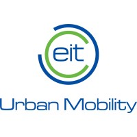

# Masterthesis
Repository with analysis, details, data and results of my Sustainable Urban Mobility thesis. 

  
  
  
  

### 
Active transport, including cycling, has gained significant international attention as a means to deal with increasing urbanisation and societal costs of urban automotive use, promising to reducing automotive use and its related socio-environmental impacts. However, the factors influencing individuals' choices to use active transport are not yet fully understood, nor are they well-defined for estimation. Literature shows that mobility choices depend on a multitude of factors, both local and regional, along with socio-economic and demographic factors. The aim of this study is to employ publicly available mobility diary logs from ODiN (Onderweg in Nederland), stacked over several years, to give accurate predictions of active mobility behaviour on a local scale. This project will analyse if it possible to make a generalisation over the Netherlands where mobility choices are related to urban variables, e.g., density and destination accessibility and more. First, a comprehensive exploratory data analysis will be performed to analyse and separate target groups, after which several prediction method are calibrated. Methods suggested are a regression model, decision tree ensembles and artificial neural networks. The results and error rates appropriate for these models will then be evaluated with the help of expert opinion, and conclusions will be drawn. Finally, a first version of an online environment will be developed, allowing for simple visualisation and simulation of value changes in specific spatial contexts. 

### Research Proposal
Download the most recent version **[here](./0-research-proposal/proposal.latest.pdf)**, or see the folder [0-research-proposal](./0-research-proposal/) with all older versions of research proposals.
